# bezier curve 2

## points and iamges
dx1 = [3:6942; 1:3690; 2:9865; 5:8509; 8:1929; 8:2098; 6:8281]
dy1 = [1:2144; 3:5925; 7:3933; 7:9217; 6:9665; 4:0396; 1:5600]
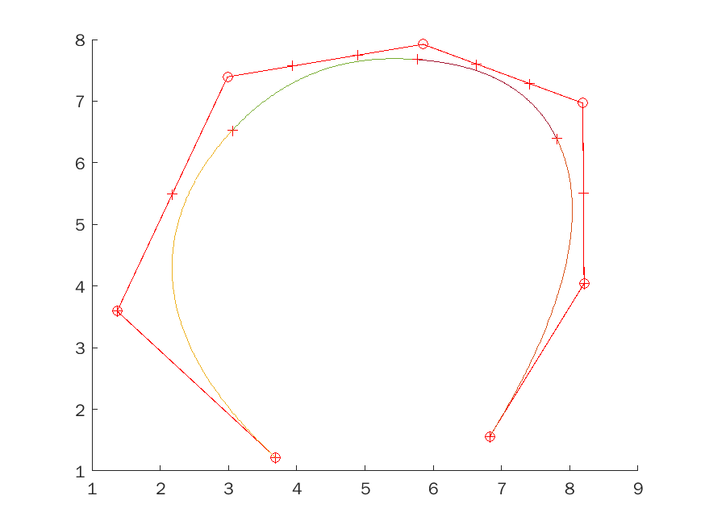
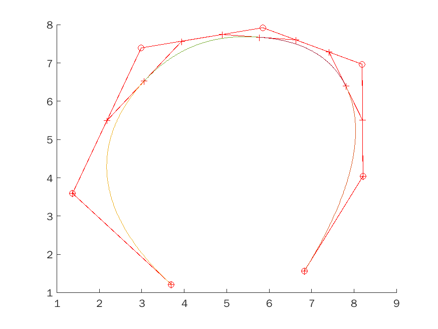

dx2 = [3:9806; 2:2789; 3:6942; 6:8618; 7:1820]
dy2 = [2:1087; 4:2429; 7:0884; 6:9461; 4:3852]
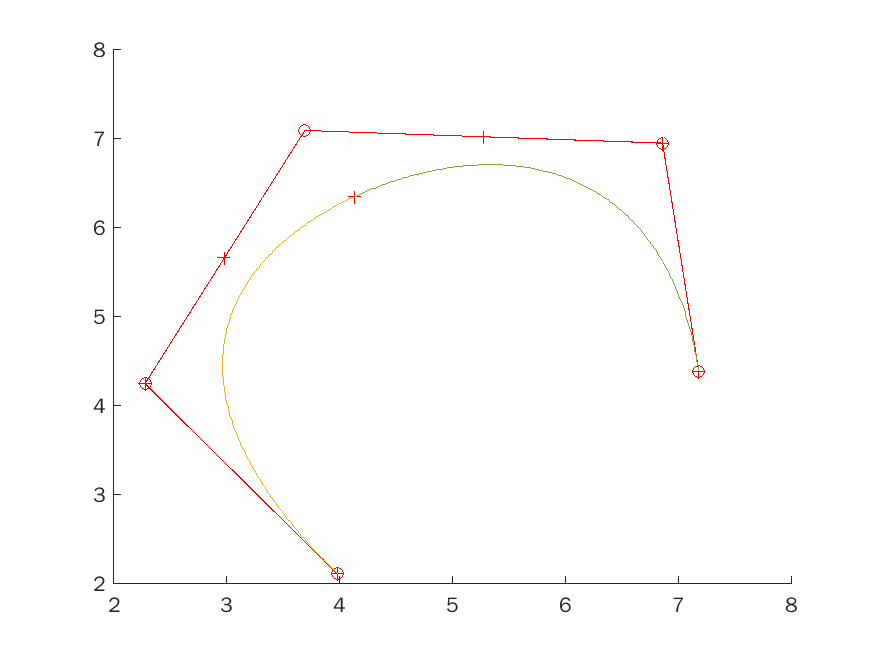
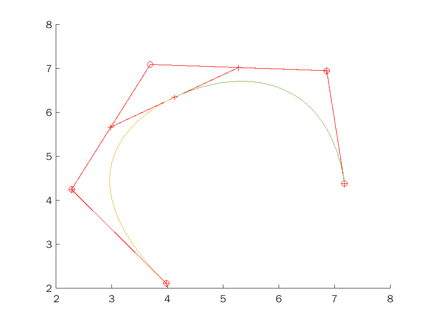

dx3 = [4:2334; 1:0826; 1:3016; 4:9579; 8:2435; 4:8062]
dy3 = [1:0315; 3:6941; 5:6250; 7:9624; 5:5640; 5:8486]
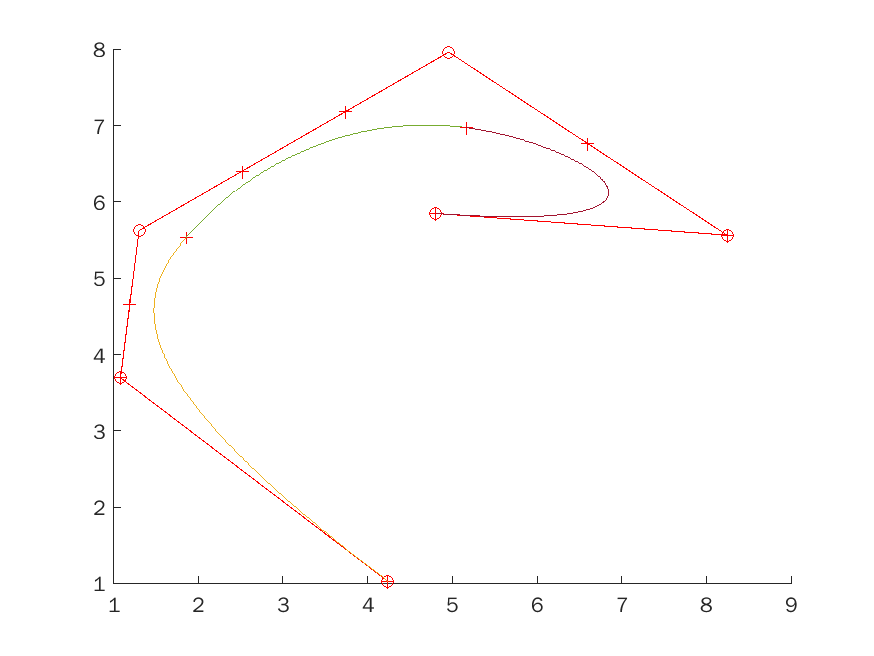
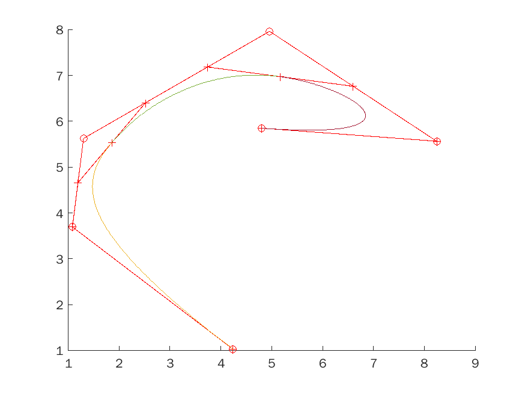

dx4 = [4:6040; 2:2283; 3:3741; 2:1609; 7:2494; 6:8955; 9:1702]
dy4 = [1:3364; 1:6616; 3:5722; 6:8242; 8:6535; 3:7957; 2:8608]
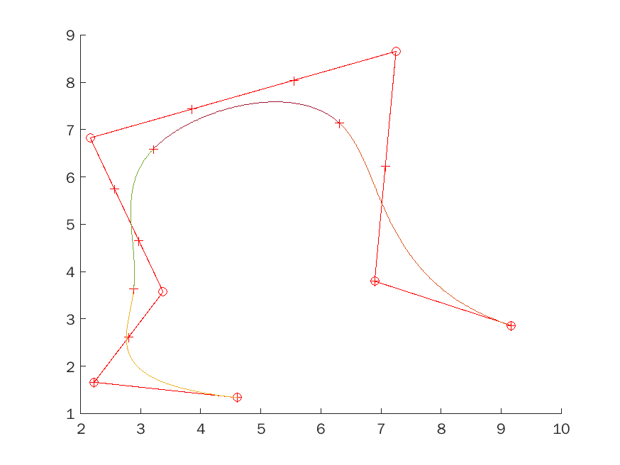
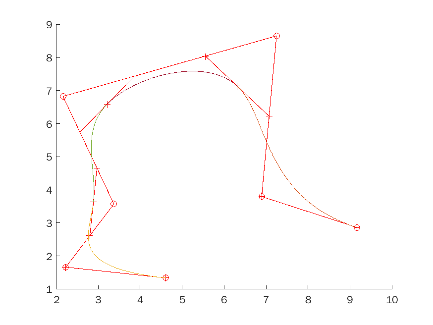

dx5 = [5:4297; 5:2275; 2:9865; 1:4532; 2:1778; 3:2898; 6:8113;
9:0691; 7:2999; 7:2157; 9:2713; 7:4853; 6:4575]
dy5 = [4:6494; 1:9055; 1:7429; 3:8974; 8:0030; 6:7429; 9:1209
7:2917; 6:4380; 2:8404; 2:7795; 0:9502; 1:3974]
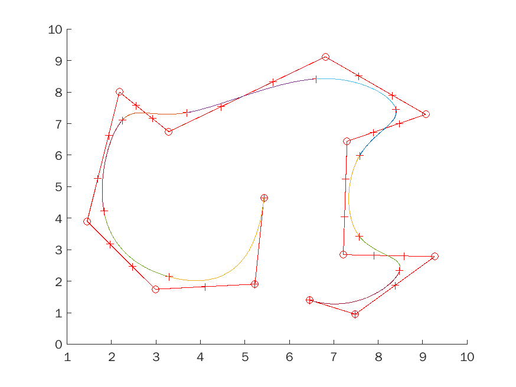
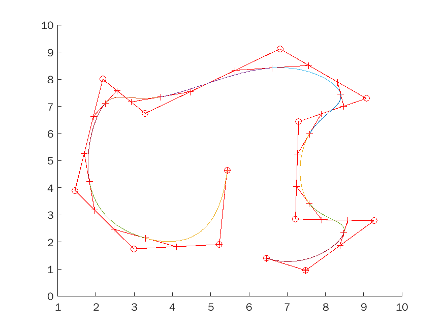

get out own points
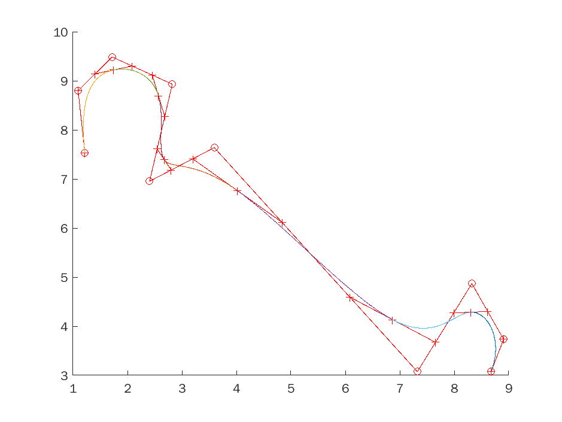
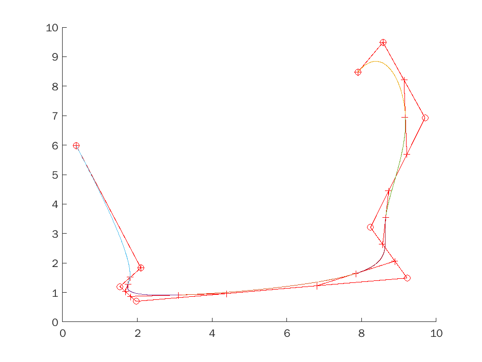
